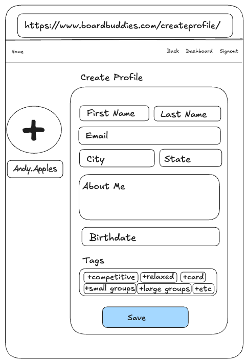

# User Graphical Human Interface

## Landing Page
This is the landing page when people visit the website.

## Create Account Page
New users can create a new account when they click "Create Account" on the navigation bar on the landing page.

## Sign In Page
Existing users can sign in to their account by clicking the "Sign In" link on the navigation bar on the landing page.

## Create Profile Page
The Create Profile page is where new users choose their profile picture from a modal and submit profile information.

## Profile Pic Modal
Users will be automatically given a default profile picture when they create their account. When the user clicks on the profile picture in the Create Profile page, they can choose from a selection of images in a modal.

## Dashboard
After creating profile as a new user or signing in as an existing user, the user is directed to their Dashboard that holds all accessible pages.

## Profile Page

Users can access their Profile page from the Dashboard by clicking their profile picture.

## Edit Profile Page
Users can edit their profile by clicking on their profile pic in their Profile page.

## Games List Page
Users can access a list of available games when they click on the "Games List" button on the Dashboard.

## Game Details Page
Users can see the details of a specific game when they click on a specific game from the Games List.

## Meetup List Page
Users can access the Meetup List page when they click on the "Find Meetups" button on the Dashboard.

## Meetup Create Page
Users can create a meetup by clicking the "Create a Meetup" button on the Meetup List page.

## Meetup Details Page
Users can click on specific meetups and join or leave as players. Organizers can also choose join their own meetup as a player. Organizers will have the ability to see a link on this page to edit or delete their meetup.

## Meetup Edit Page
Organizers can edit their meeetup via a link that appears just for them in the Meetup Detail page of the meetup they organized. They can make edits to their meetup or delete it.

